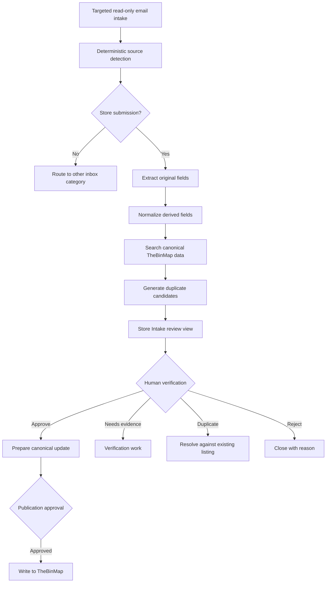

# Graph Engineering for Governed AI Operations

## Purpose

This document translates the supplied graph-engineering transcript into an operational resource for designing, reviewing, and improving AI-enabled work.

It is intended for both:

- **humans**, who decide what work matters, where risk exists, and when approval is required; and
- **agents**, which need explicit jobs, inputs, outputs, permissions, checks, stop conditions, and handoffs.

The central idea is simple:

> Do not ask one model to perform an entire consequential task inside one long conversation. Design the work as a small, inspectable system of jobs, dependencies, checks, and human decisions.

Graph engineering is therefore less about drawing diagrams and more about **designing reliable work around AI**.

---

# 1. Core Concepts

## 1.1 Prompt engineering

Prompt engineering improves **how a task is requested**.

It focuses on:

- instructions;
- examples;
- output formats;
- constraints;
- tone;
- role framing.

Prompt engineering remains useful, but a strong prompt cannot correct a poorly designed workflow.

## 1.2 Context engineering

Context engineering improves **what information the model receives**.

It focuses on:

- relevant documents;
- retrieved evidence;
- prior decisions;
- user preferences;
- tool results;
- current system state;
- provenance and freshness.

Context engineering reduces guessing, but good context alone does not define who checks the work or what happens next.

## 1.3 Graph engineering

Graph engineering defines **how work moves**.

It specifies:

- the jobs or nodes;
- the dependencies or edges;
- the shared state;
- parallel work;
- conditional branches;
- review steps;
- loops;
- permissions;
- human approval gates;
- completion criteria.

A graph turns a vague request into a controlled operating process.

## 1.4 Nodes, edges, and state

### Node

A node is a bounded job.

Examples:

- clarify the question;
- inspect customer evidence;
- extract fields;
- run tests;
- challenge assumptions;
- prepare a recommendation;
- request approval.

### Edge

An edge defines when and where work moves next.

Examples:

- research feeds the skeptic;
- the skeptic feeds the synthesizer;
- a failed test returns work to implementation;
- a high-risk decision routes to the Board.

### State

State is the durable information available to the workflow.

Examples:

- source documents;
- findings;
- confidence;
- unresolved questions;
- test results;
- issue status;
- approvals;
- rejected alternatives;
- final decisions.

State should be explicit, inspectable, and reusable.

---

# 2. Two Different Meanings of “Graph”

## 2.1 Knowledge graph

A knowledge graph represents relationships among entities, claims, events, systems, and evidence.

Example:

```text
Store submission
  → refers to Store
  → located in City
  → submitted by Person
  → may duplicate Existing Listing
  → supported by Evidence
```

Knowledge graphs help answer questions that require traversing relationships rather than retrieving the nearest paragraph.

They help AI understand **how information connects**.

## 2.2 Agent graph

An agent graph represents how jobs, checks, and decisions move through a workflow.

Example:

```text
Ingest
  → classify
  → extract
  → duplicate check
  → human verification
  → approve or reject
```

Agent graphs help AI understand **how work should move**.

## 2.3 Best combined model

Mature governed systems use both:

- the **knowledge graph** explains relationships in the evidence;
- the **agent graph** controls what work happens next.

They should not be conflated.

For QSL systems:

- **Graphify** should represent derived structural relationships;
- **Paperclip** should orchestrate missions and operational handoffs;
- **Claude–Obsidian or another governed vault** should preserve source evidence and durable memory;
- **Chronicle** should record material governance events;
- **the Human Board** should retain authority over consequential actions.

---

# 3. When Graph Engineering Is Worth Using

Use graph engineering when at least several of these conditions are present:

- the task has multiple meaningful steps;
- multiple sources must be examined;
- independent work can run in parallel;
- the final result affects money, customers, production, security, or reputation;
- evidence must be challenged;
- different permissions apply to different steps;
- the workflow may branch;
- failures require retry or escalation;
- human approval is necessary;
- the work should create durable memory;
- the process will be repeated.

Examples:

- deep research;
- code review and deployment;
- store-submission intake;
- customer-support triage;
- sales-call preparation;
- security investigations;
- recurring content production;
- product or market validation;
- intelligence-brief creation;
- data verification and publication.

Do **not** build a graph merely because agents are available.

A graph is usually unnecessary for:

- generating a few names;
- summarizing a short, low-risk message;
- rewriting a paragraph;
- answering a stable factual question;
- performing a one-step calculation.

The objective is the **smallest graph that materially improves quality, traceability, or safety**.

---

# 4. Core Techniques

## 4.1 Begin with the final outcome

Write the desired result in one sentence before designing the workflow.

Examples:

- “Produce a one-page recommendation on whether this market is worth testing.”
- “Turn one verified email submission into a review-ready store-intake record.”
- “Produce a tested patch and a human-reviewable pull request.”
- “Publish a sourced intelligence brief after evidence review.”

A graph without a clear outcome tends to expand indefinitely.

## 4.2 Decompose the work into real jobs

Ask:

> What would a careful, competent human team actually do?

Do not begin by naming agents. Begin by naming work.

Weak decomposition:

```text
Research Agent
Writing Agent
Review Agent
```

Stronger decomposition:

```text
Clarify decision
Collect customer evidence
Map competitors
Analyze distribution
Identify risks
Challenge unsupported claims
Synthesize surviving evidence
Request human decision
```

Each node should have one primary responsibility.

## 4.3 Draw dependencies, not a decorative sequence

Only connect jobs that truly depend on one another.

Examples:

- customer research and competitor research can run in parallel;
- synthesis must wait for evidence;
- deployment must wait for tests and approval;
- duplicate review must wait for normalized intake data.

This removes fake waiting and shortens elapsed time.

## 4.4 Parallelize independent work

Parallel work is valuable when tasks:

- use different sources;
- answer independent questions;
- do not modify the same state;
- can be merged later.

Examples:

- customer, competitor, distribution, pricing, and risk research;
- code implementation, test design, and documentation inspection;
- form-signature analysis and canonical-schema analysis.

Do not parallelize work that competes for the same mutable resource without coordination.

## 4.5 Separate workers from checkers

A model should not be trusted merely because it confidently grades its own work.

Separate roles for:

- production;
- verification;
- skepticism;
- testing;
- approval.

A checker should receive:

- the claimed result;
- the evidence;
- the acceptance criteria;
- known risks;
- permission to reject or return the work.

## 4.6 Use a skeptic node

The skeptic is not a stylistic critic. It attacks weak reasoning.

It should ask:

- Which claims lack evidence?
- Which evidence is stale?
- What alternative explanation was ignored?
- What competitor, failure mode, or edge case is missing?
- Are we confusing interest with willingness to pay?
- Did the model infer facts not present in the source?
- Does confidence exceed the evidence?
- What would change the recommendation?

A skeptic should produce findings, not rewrite the entire deliverable.

## 4.7 Merge only surviving evidence

The synthesis node should not simply concatenate every output.

It should:

- remove rejected claims;
- preserve disagreement;
- distinguish facts from inference;
- retain uncertainty;
- identify decisive evidence;
- state what remains unknown;
- generate the smallest actionable conclusion.

## 4.8 Place humans where mistakes are expensive

Human gates should become stricter as consequence rises.

Light gate:

- internal draft;
- exploratory memo;
- low-risk brainstorming.

Strong gate:

- customer communication;
- refunds;
- production changes;
- security actions;
- publication;
- legal claims;
- financial decisions;
- canonical data updates.

Human-in-the-loop does not mean a person must manually perform every step. It means authority is placed where consequences justify it.

## 4.9 Stop when the answer is good enough

Every graph needs a stop condition.

Examples:

- evidence threshold reached;
- required tests passed;
- recommendation approved;
- no unresolved critical findings;
- timebox reached;
- one bounded item processed;
- retry limit exceeded and escalated.

Without a stop condition, graphs become expensive loops that coordinate more than they accomplish.

## 4.10 Preserve useful state

A successful graph should leave behind:

- evidence;
- plans;
- findings;
- decisions;
- rejected paths;
- confidence;
- review notes;
- test results;
- approvals;
- unresolved work.

This is the compounding advantage: each workflow produces memory that improves the next workflow.

---

# 5. Implementation Levels

## Level 1 — Manual graph

Use:

- a whiteboard;
- Excalidraw;
- TLDraw;
- a Markdown checklist;
- separate chat lanes.

Recommended first step:

```text
Outcome
  → planner
  → parallel workers
  → skeptic
  → synthesis
  → human approval
```

Run the workflow manually before automating it.

## Level 2 — File-backed graph

Use a repository or governed workspace where each node writes a durable artifact.

Example:

```text
plan.md
customer-research.md
competitor-research.md
distribution-research.md
skeptic-review.md
recommendation.md
decision.md
```

Benefits:

- version history;
- paper trail;
- inspectable handoffs;
- repeatability;
- reusable templates;
- easier review.

This level is often sufficient for valuable work.

## Level 3 — Orchestrated graph

Use an orchestration system when the manual/file-backed workflow has proven value.

Resources named in the transcript include:

- **LangGraph** for stateful workflows, checkpoints, persistence, and human approval;
- **AutoGen GraphFlow** for sequential, parallel, conditional, and looping agent workflows;
- **n8n** or **Make** when workflows connect to business systems such as email, Slack, Airtable, or CRMs;
- **Claude Code or similar repository agents** for file-backed implementation workflows;
- **small custom scripts** when a focused workflow does not justify a large framework.

For QSL, Paperclip is the natural operational orchestration layer when its capabilities match the mission.

Automation should follow understanding, not replace it.

---

# 6. QSL Relevance

The transcript strongly supports QSL’s existing direction:

> governed intelligence systems that are observable, auditable, secure, and accountable.

Graph engineering is relevant because it provides a practical operating model for those qualities.

## 6.1 Observable

Every node has a defined job and output.

Operators can see:

- what happened;
- which agent performed it;
- what evidence was used;
- why the next step occurred.

## 6.2 Auditable

Durable state creates a reviewable chain:

```text
source
→ extraction
→ interpretation
→ challenge
→ decision
→ action
```

## 6.3 Secure

Permissions can be assigned per node.

Examples:

- one agent may read Gmail but not send;
- one node may inspect TheBinMap data but not modify it;
- one agent may prepare a deployment but not execute it;
- a Board gate may authorize production changes.

## 6.4 Accountable

Human authority is explicit.

The system records:

- who approved;
- what was approved;
- which evidence supported the decision;
- what limits applied;
- what action occurred.

## 6.5 Memory-producing

Each completed graph creates institutional knowledge instead of losing decisions inside chat history.

This supports the QSL goal that knowledge should outlive:

- individual models;
- individual agents;
- individual conversations;
- individual operators.

---

# 7. Mapping to the Paperclip Store-Intake Workflow

The current TheBinMap email mission is a direct example of agent-graph engineering.

## 7.1 Minimal operational graph



## 7.2 Node responsibilities

### Intake node

- reads one bounded message;
- preserves Gmail state;
- creates a deduplicated origin record;
- has no outbound permission.

### Source-detection node

- uses deterministic evidence first;
- returns `unknown` when evidence is insufficient;
- reports confidence and matched rules.

### Extraction node

- preserves original submitted values;
- stores normalized values separately;
- records field-level evidence;
- identifies missing fields.

### Duplicate-check node

- has read-only access to canonical store data;
- returns candidates, not automatic decisions;
- explains match reasons.

### Review-view node

- presents evidence, normalized fields, missing data, and candidates;
- does not alter canonical data.

### Human-verification gate

- decides whether to verify, reject, merge, or request more evidence.

### Publication gate

- remains separate from intake;
- requires explicit authorization;
- preserves provenance.

## 7.3 Why this is a graph, not “email automation”

The real work is not simply “read an email.”

It is:

```text
identify
→ interpret
→ structure
→ compare
→ review
→ decide
→ authorize
→ publish
```

That distinction is central to governed automation.

---

# 8. Reusable Graph Design Template

## 8.1 Mission definition

```markdown
# Mission

## Desired outcome
[One sentence.]

## Why it matters
[Business, operational, security, or research value.]

## Completion condition
[Observable result that ends the mission.]

## Out of scope
[Explicitly deferred work.]
```

## 8.2 Node contract

```markdown
## Node: [Name]

### Purpose
[One bounded responsibility.]

### Inputs
- [Input]
- [Input]

### Required context
- [Evidence or state]

### Allowed tools
- [Tool]

### Permissions
- Read:
- Write:
- External action:

### Output
[Exact artifact or structured result.]

### Acceptance criteria
- [Criterion]
- [Criterion]

### Failure behavior
[Retry, return, stop, or escalate.]

### Stop condition
[When this node is complete.]
```

## 8.3 Edge contract

```markdown
## Handoff: [Node A] → [Node B]

### Trigger
[Condition that activates the handoff.]

### Data transferred
- [State]
- [Evidence]

### Data excluded
- [Secrets or irrelevant context]

### Validation
[What must be true before Node B begins.]
```

## 8.4 Human gate contract

```markdown
## Human Gate: [Decision]

### Decision owner
[Person, Board, or role.]

### Options
- Approve
- Reject
- Return for revision
- Request more evidence

### Required evidence
- [Evidence]
- [Test result]

### Consequence
[What happens after each decision.]

### Recorded state
- decision;
- decision-maker;
- timestamp;
- evidence reviewed;
- conditions or limits.
```

---

# 9. Graph State Schema

A generic governed state object can include:

```yaml
mission_id: ""
workflow_version: ""
status: "planned | active | blocked | review | approved | rejected | complete"

desired_outcome: ""
current_node: ""
completed_nodes: []
pending_nodes: []

inputs: []
evidence: []
findings: []
rejected_claims: []
open_questions: []

confidence:
  overall: 0.0
  reasons: []

risk:
  level: "low | medium | high | critical"
  factors: []

permissions:
  read: []
  write: []
  external_actions: []

approvals: []
test_results: []
decisions: []

next_action: ""
stop_reason: ""
```

The exact schema should remain proportional to the workflow. Do not create a universal state model that is larger than the work itself.

---

# 10. Agent Role Patterns

## Planner

Purpose:

- clarify the decision;
- identify required work;
- define dependencies;
- detect opportunities for parallelism;
- set acceptance criteria.

The planner should not perform all downstream work.

## Specialist worker

Purpose:

- answer one bounded question;
- use assigned sources;
- distinguish evidence from inference;
- return unresolved issues.

## Skeptic

Purpose:

- challenge claims;
- identify missing evidence;
- test alternative explanations;
- find stale or weak sources;
- flag unjustified confidence.

## Tester or verifier

Purpose:

- evaluate observable behavior against acceptance criteria;
- execute real tests;
- report failures precisely;
- avoid substituting simulated logic for actual validation.

## Synthesizer

Purpose:

- merge accepted findings;
- preserve disagreement and uncertainty;
- produce a concise decision artifact;
- state what would change the recommendation.

## Human decision owner

Purpose:

- apply judgment;
- consider consequences beyond model context;
- authorize expensive or irreversible actions;
- record the decision and conditions.

---

# 11. Risk-Based Human Gates

| Action | Default gate |
|---|---|
| Internal brainstorming | Optional review |
| Private research memo | Light review |
| Customer classification | Review on low confidence |
| Customer response draft | Human approval before sending |
| Refund or account change | Strong approval |
| Store canonical-data update | Human verification and approval |
| Public publication | Editorial approval |
| Code merge | Diff, tests, and human approval |
| Production deployment | Backup, health check, rollback, explicit approval |
| Security remediation | Strong approval with evidence |
| Credential or permission change | Strong approval and audit record |

The graph should make these gates visible before work begins.

---

# 12. Anti-Patterns

## 12.1 The giant chat blob

One model:

- defines the problem;
- researches;
- interprets;
- writes;
- grades itself;
- recommends action.

Risk:

- hidden assumptions;
- weak provenance;
- no independent checking;
- difficult correction.

## 12.2 Tool-first automation

The team selects LangGraph, n8n, or another framework before understanding the workflow.

Risk:

- automating confusion;
- unnecessary complexity;
- expensive maintenance;
- unclear success criteria.

## 12.3 Agent inflation

Adding many agents because a large graph appears sophisticated.

Risk:

- repeated errors;
- coordination overhead;
- noisy outputs;
- unclear ownership.

## 12.4 Self-review as assurance

The same worker claims its result is correct.

Risk:

- confirmation bias;
- shallow testing;
- false confidence.

## 12.5 Hidden state

Important decisions remain only in a conversation.

Risk:

- no institutional memory;
- repeated mistakes;
- impossible audit.

## 12.6 Missing stop condition

The graph continues reviewing, researching, or refining.

Risk:

- time and token waste;
- analysis paralysis;
- delayed business value.

## 12.7 Automatic action before evidence review

The workflow publishes, sends, deletes, deploys, or modifies canonical data immediately after extraction.

Risk:

- irreversible mistakes;
- customer harm;
- lost provenance.

## 12.8 Treating derived structure as truth

A graph or model-generated relationship is accepted as canonical evidence.

Risk:

- inferred connections become false facts.

Derived maps must remain traceable to sources.

---

# 13. Manual-First Validation Rule

Before automating a workflow, run it manually enough times to understand:

- the real nodes;
- recurring exceptions;
- required evidence;
- where human judgment matters;
- which state is reusable;
- what can safely run in parallel;
- what should never be automated.

A useful working rule:

```text
Draw it once.
Run it manually.
Repeat until the value is clear.
Automate only the stable portions.
```

The transcript suggests roughly three successful manual runs as a reasonable signal before investing in advanced orchestration. Treat this as guidance, not a universal requirement.

---

# 14. Workflow Evaluation Checklist

## Outcome

- [ ] Is the final result stated in one sentence?
- [ ] Is the completion condition observable?
- [ ] Is unnecessary work explicitly out of scope?

## Nodes

- [ ] Does each node have one primary responsibility?
- [ ] Are inputs and outputs explicit?
- [ ] Are tools and permissions bounded?
- [ ] Are failure behaviors defined?

## Dependencies

- [ ] Are edges based on real dependencies?
- [ ] Can independent work run in parallel?
- [ ] Are mutable resources protected from conflicting writes?

## Evidence

- [ ] Are sources preserved?
- [ ] Are facts separated from inference?
- [ ] Is confidence justified?
- [ ] Is freshness considered?
- [ ] Can claims be traced back to evidence?

## Review

- [ ] Is production separate from checking?
- [ ] Is there a skeptic or verifier where needed?
- [ ] Can a checker reject or return work?
- [ ] Are real tests used instead of copied logic?

## Human authority

- [ ] Is there a human gate before expensive actions?
- [ ] Is the decision owner named?
- [ ] Are approval conditions recorded?

## State and memory

- [ ] Does the workflow preserve useful artifacts?
- [ ] Can another agent or human resume from state?
- [ ] Are rejected findings retained when useful?
- [ ] Is sensitive state excluded from logs and prompts?

## Efficiency

- [ ] Is this the smallest graph that improves the work?
- [ ] Does it stop when good enough?
- [ ] Has fake waiting been removed?
- [ ] Is automation justified by repeated value?

---

# 15. Minimal Prompt for Designing a Graph

```text
Design the smallest governed workflow graph that can reliably produce
the requested outcome.

Begin by stating the final outcome and completion condition.

Then identify:

1. the real jobs a competent human team would perform;
2. which jobs depend on others;
3. which jobs can run in parallel;
4. what state must pass between jobs;
5. which worker outputs require independent checking;
6. where a skeptic should challenge evidence;
7. where human approval is required;
8. the permissions of each job;
9. failure, retry, and escalation behavior;
10. the stop condition.

Do not select an orchestration framework until the workflow is clear.
Do not create extra agents without a measurable quality or safety benefit.
Preserve evidence, decisions, unresolved questions, and provenance.
Return a Mermaid diagram and a node-contract table.
```

---

# 16. Suggested QSL Operating Doctrine

## Doctrine 1 — Workflow before framework

Choose tools after the work is understood.

## Doctrine 2 — Evidence before recommendation

Recommendations must emerge from traceable evidence.

## Doctrine 3 — Checker independence

Consequential work requires a distinct verification role.

## Doctrine 4 — Human authority at consequential edges

Agents may prepare actions; humans authorize expensive, public, security-sensitive, or irreversible actions.

## Doctrine 5 — Least privilege per node

Every node receives only the tools and permissions necessary for its job.

## Doctrine 6 — Original evidence and derived interpretation remain separate

Normalization, extraction, scoring, and graph relationships must not overwrite source evidence.

## Doctrine 7 — Smallest useful graph

Complexity must earn its place.

## Doctrine 8 — Durable state is a product

Plans, evidence, reviews, decisions, and outcomes should be reusable organizational memory.

## Doctrine 9 — Manual proof before automation

Automate stable, valuable behavior—not assumptions.

## Doctrine 10 — Explicit termination

Every graph must know when to stop, escalate, or request a Board decision.

---

# 17. Immediate Applications Across QSL

## Paperclip email operations

```text
ingest
→ classify
→ extract
→ duplicate check
→ prioritize
→ notify
→ human review
```

## QSL security investigation

```text
scope
→ collect evidence
→ parallel technical analysis
→ adversarial review
→ severity assessment
→ remediation proposal
→ Board approval
→ controlled action
→ Chronicle record
```

## TheBinMap intelligence brief

```text
define issue
→ collect store evidence in parallel
→ verify sources
→ challenge weak findings
→ synthesize route and buying intelligence
→ editorial review
→ publish
```

## Client-acquisition research

```text
define offer
→ customer research
→ competitor research
→ channel research
→ willingness-to-pay challenge
→ offer synthesis
→ human decision
→ small market test
```

## Code delivery

```text
plan
→ implement
→ review diff
→ run tests
→ inspect UI or runtime
→ security check
→ human PR approval
→ merge
→ controlled deployment
```

---

# 18. Final Interpretation

The transcript’s most important contribution is not a new software category. It is a change in operating mindset:

```text
from asking for one answer
to designing the path that produces a trustworthy answer
```

Graph engineering is valuable when it creates:

- better decomposition;
- real parallelism;
- independent checking;
- explicit authority;
- durable state;
- reusable memory;
- controlled automation.

It becomes harmful when it creates:

- unnecessary agents;
- decorative complexity;
- endless loops;
- untraceable state;
- automated action without evidence or approval.

For QSL, graph engineering should be treated as a practical design discipline for governed intelligence—not as a requirement to adopt a particular framework.

The correct progression is:

```text
understand the work
→ draw the smallest useful graph
→ run it manually
→ preserve the state
→ measure the value
→ automate only what has proven reliable
```
